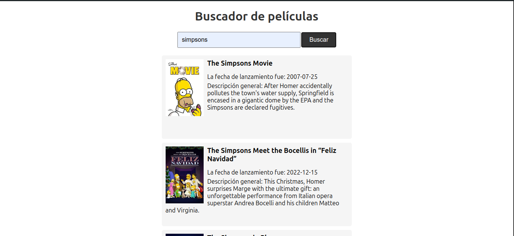

# Descripción del Repositorio
- Este repositorio contiene un proyecto de un buscador de peliculas, se ingresa el titulo de la pelicula en el recuadro, se da clic en el boton buscar y se muestran la imagen y titulo de la
pelicula asi como su fecha de lanzamiento y descripción general de la trama. La aplicación se conecta a la API externa de "The Movie Database" para traer toda la informacion de las peliculas.

## Tecnologias utilizadas
- Para la realizacion de este proyecto se utilizaron las siguientes tecnologias:
  - [Html](https://developer.mozilla.org/es/docs/Web/HTML): Lenguaje de marcado para esrtuctura basica del proyecto en la web.
  - [Css](https://developer.mozilla.org/es/docs/Web/CSS): Lenguaje de estilos para dar presentacion al proyecto web.
  - [Javascript](https://developer.mozilla.org/es/docs/Web/javascript): Lenguaje de programación para desarrollo de forntend y Backend.
  - [The Movie Database](https://www.themoviedb.org/): Es una plataforma en línea que sirve como una base de datos cinematográfica que ofrece a los desarrolladores de aplicaciones y sitios
    web una API abierta que les permite la integración de su extenso catálogo de información en diversas plataformas y proyectos.

## Imagenes del proyecto
- Imagen 1 del buscador de Peliculas

  

- Imagen 2 del buscador de Peliculas

  
  

## Link del proyecto en la web
- [Buscador de peliculas](https://buscador-de-peluculas.netlify.app/).
